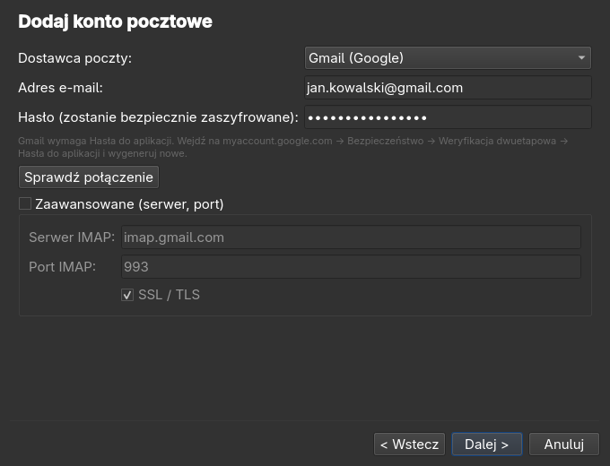
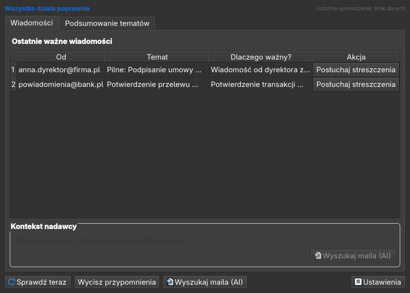
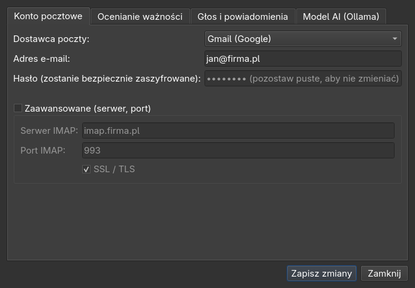
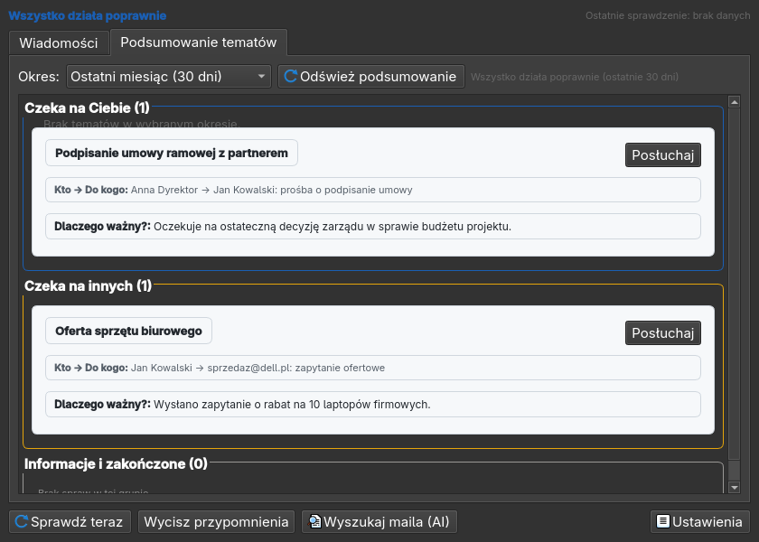
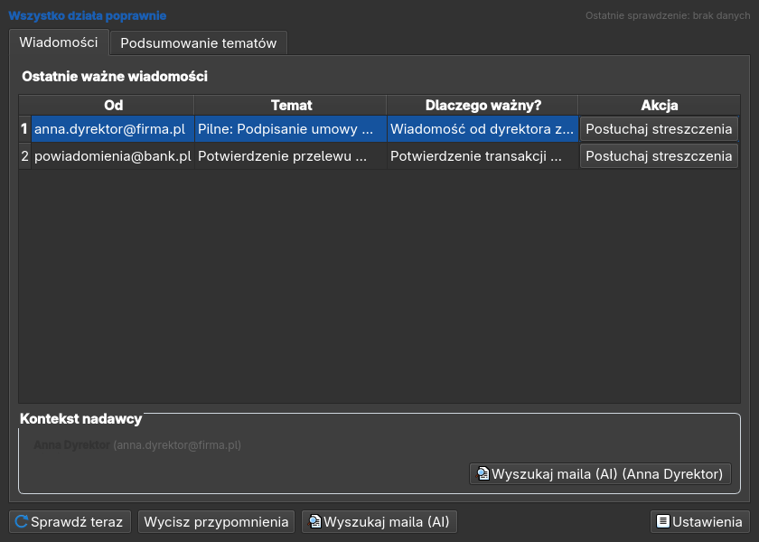
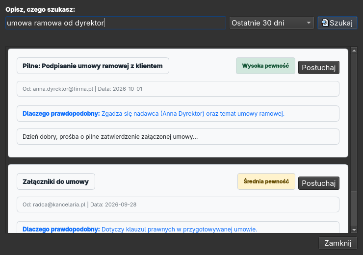

# MailVoice (read_my_emails_omarchy)

[🇬🇧 English](README.md) · **🇵🇱 Polski**

> 🚧 **Projekt roboczy.** Rdzeń logiki, GUI, warstwa głosowa i aplikacja na Androida mają testy i były **częściowo
> testowane na żywej poczcie** (pobieranie IMAP, analiza AI, głos, parowanie i powiadomienia na telefonie — Linux/Omarchy
> + Android 14). **Windows, sprzętowe klucze FIDO2 i więcej dostawców poczty nadal czekają na testy.**
> Zgłoszenia błędów i pull requesty są bardzo mile widziane.

Aplikacja desktopowa na **Linuksa (tworzona z myślą o [Omarchy](https://omarchy.org)) i Windows**: pobiera pocztę z kilku
skrzynek IMAP, **lokalny model AI (Ollama)** ocenia, które nowe wiadomości naprawdę są dla Ciebie ważne, a program
informuje o nich **głosem po polsku lub angielsku** — streszczeniem w 3–4 zdaniach zamiast czytania całego maila.
Ma być obsługiwalna także dla osób niezaawansowanych technicznie.

Poczta nie opuszcza Twojego komputera: analiza działa na **Twoim własnym serwerze Ollama** (lokalnym lub w sieci LAN).

## Co potrafi

- **Kilka skrzynek** (Gmail, Outlook/Microsoft 365, WP, Onet, O2, Interia, dowolny serwer IMAP).
- **Analizuje tylko nowe maile.** Już widziane są pomijane w kolejnych cyklach (śledzenie UID + deduplikacja po
  `Message-ID`, odporność na reset `UIDVALIDITY`).
- **„Co jest dla mnie ważne” własnymi słowami.** Opisujesz zwykłym językiem, jak oceniać pocztę; dodajesz nadawców VIP,
  słowa kluczowe i blokady; odpowiedzi na wysłane przez Ciebie maile dostają bonus. Najpierw działa tania warstwa
  reguł, resztę ocenia model i zwraca walidowany JSON (ważność 0–10, powód, akcja, język).
- **Powiadomienia głosowe.** Wybierasz: powtarzany sygnał dźwiękowy albo pytanie *„Czy masz teraz czas posłuchać nowych
  maili?”*. Potem czyta krótkie streszczenie (maks. 4 zdania) każdego maila i rozumie komendy *następny / powtórz /
  pomiń / stop* (PL + EN).
- **Zaległe, starsze nieprzeczytane maile.** Jeśli któreś wyglądają na ważne, aplikacja pyta osobno, czy chcesz je
  usłyszeć. Odpowiedź jest zapamiętywana, także po restarcie.
- **Podsumowanie tematów — „łączenie kropek”.** Domyślnie ostatni miesiąc (konfigurowalnie): wątki, kto do kogo pisał,
  dlaczego i czy sprawa czeka na Ciebie, czy na innych. *(Używane na żywej poczcie, także z folderem Wysłane.)*
- **Karta kontaktu i „Wyszukaj maila (AI)”.** Pokazuje pełny kontekst osoby, gdy zamierzasz odpisać, i znajduje
  najbardziej prawdopodobne maile z opisu własnymi słowami, z uzasadnieniem i pewnością. *(Pokryte testami; na żywej poczcie jeszcze mało używane.)*
- **Przyciski „Ignoruj…” i „VIP…”** przy każdym ważnym mailu (komputer i telefon): zignoruj *podobne maile* (ten sam nadawca
  i temat), *wszystko od nadawcy* albo *całą domenę* — lub działaj odwrotnie i oznacz jako **VIP**, żeby takie maile
  zawsze powiadamiały. Reguły są na liście w Ustawieniach (można je usuwać); zignorowane wątki znikają z podsumowania
  tematów, a wątki VIP są na początku. Mail wyglądający na phishing nigdy nie zostanie VIP-em jednym kliknięciem.
  Opcjonalnie wszyscy, do kogo pisałeś (folder Wysłane), są traktowani jako znani korespondenci.
- **Prosty kreator konfiguracji**, błędy po ludzku, duże przyciski, interfejs PL/EN.

### Zrzuty ekranu

| Kreator | Okno główne | Ustawienia |
|---|---|---|
|  |  |  |

| Podsumowanie tematów | Kontekst kontaktu | Wyszukiwanie AI |
|---|---|---|
|  |  |  |

*Zrzuty zrobione w trybie offscreen na danych przykładowych.*

## Prywatność i bezpieczeństwo

- **Tylko odczyt.** Aplikacja niczego nie wysyła, nie usuwa ani nie oznacza jako przeczytane (`BODY.PEEK`).
- **Tylko lokalne AI.** Treść maili trafia wyłącznie do skonfigurowanych przez Ciebie adresów Ollamy.
- **Hasła** są w systemowym keyringu (rezerwa: plik szyfrowany AES-256-GCM z kluczem scrypt; opcjonalnie ochrona kluczem
  FIDO2 `hmac-secret`). Nigdy nie trafiają do pliku konfiguracyjnego ani do logów.
- **TLS jest obowiązkowy** dla IMAP; połączenia nieszyfrowane są odrzucane.
- **Lokalny indeks przechowuje tylko metadane i krótkie podsumowania** (nigdy pełnych treści maili), z limitem retencji
  (`index_retention_days`, domyślnie 90).
- **Zasady antyphishingowe są nienaruszalne** — zob. [`SECURITY.md`](SECURITY.pl.md): aplikacja nigdy nie otwiera
  linków, nie pobiera załączników i nie słucha instrukcji zawartych (także ukrytych) w mailach. Wdrożone: bezpieczne pobieranie
  bez treści załączników, usuwanie ukrytego tekstu, znaczniki danych niezaufanych przeciw prompt injection, ocena
  ryzyka phishingu (podszywanie się, podobne domeny, wyłudzanie danych z linkiem do obcej domeny, podszywanie pod marki),
  linki rozbrojone i nigdy nie czytane głosem oraz testy statyczne zakazujące otwierania linków. Heurystyki były
  strojone tylko na kilku prawdziwych skrzynkach — kolejne przypadki mile widziane w [#9](../../issues/9).

## Stan prac

| Obszar | Status |
|---|---|
| Konfiguracja, deduplikacja w SQLite, parser maili, reguły, klient Ollamy z failoverem LAN/lokalny, streszczenia | ✅ |
| Pobieranie IMAP (tylko odczyt, tylko TLS), zaległe nieprzeczytane, pipeline, scheduler, pętla serwisu | ✅ (testowane tylko na atrapach) |
| Sejf haseł: keyring, szyfrowany plik, backend FIDO2 | ✅ (FIDO2 tylko na atrapie urządzenia) |
| Głos: Piper TTS, faster-whisper STT, dialog, beeper | ✅ (atrapy; bez testu na prawdziwym audio) |
| GUI: kreator, okno główne, ustawienia, zasobnik, PL/EN | ✅ (używane na żywo na Linuksie) |
| Podsumowanie tematów, łączenie wątków, karta kontaktu, wyszukiwanie AI | ✅ (z indeksowaniem wysłanych) |
| Utwardzenie antyphishingowe | ✅ wdrożone, heurystyki strojone na kilku prawdziwych skrzynkach ([#9](../../issues/9)) |
| Aplikacja na Androida (parowanie QR, powiadomienia, głos, podsumowanie tematów, Ignoruj/VIP) | ✅ przetestowana na prawdziwym telefonie |
| Testy na żywej poczcie: IMAP + AI + głos na Linuksie | ✅ częściowo (kilka skrzynek) |
| Więcej dostawców (Gmail/Outlook), Windows, pakowanie (.exe/AppImage) | ⏳ ([#3](../../issues/3)) |

Szczegóły i decyzje architektoniczne: [`AGENTS.md`](AGENTS.md). Otwarte zadania są w [Issues](../../issues) —
kilka nadaje się na dobry początek.

## Omarchy / Arch Linux (platforma główna)

MailVoice powstaje i jest testowany na [Omarchy](https://omarchy.org) (Arch, Hyprland, Wayland). Kilka rzeczy typowych dla Archa:

- **Menedżer pakietów to `pacman`, nie `apt`**: `sudo pacman -S <pakiet>` (nie `pacman install`). Do głosu **nie potrzebujesz
  żadnego pakietu systemowego** — Piper i `sounddevice` instalują się przez `pip`; PortAudio i PipeWire są w Omarchy.
- **Python 3.12 przez `mise`.** Arch ma najnowszy Python (3.14), dla którego część zależności nie ma jeszcze gotowych
  paczek. Omarchy zawiera `mise`, więc użyj go do lokalnej wersji 3.12:
  ```bash
  mise install python@3.12
  git clone https://github.com/wasyleque/read_my_emails_omarchy.git && cd read_my_emails_omarchy
  "$(mise where python@3.12)/bin/python3.12" -m venv .venv
  source .venv/bin/activate
  pip install -e ".[voice]"
  ```
- **Ollama**: `sudo pacman -S ollama` (z kartą NVIDIA: `ollama-cuda`), potem `ollama pull qwen3:8b`. Kreator wykrywa ją
  automatycznie; działa też Ollama na innym komputerze w sieci LAN (adres wpisz w sekcji *Zaawansowane*).
- **Hasła** trafiają do pęku kluczy Omarchy (`gnome-keyring` / Secret Service) — nic nie trzeba konfigurować.
- **Uruchomienie:** `python -m mailvoice` albo po prostu `mailvoice` (w środowisku venv). ⚠️ Wpisanie
  `python -m mail<Tab>` może dopełnić się do wbudowanego modułu `mailbox`, który nic nie robi — wpisz całą nazwę `mailvoice`.
- **Wpis w menu aplikacji** (pojawi się w launcherze Omarchy):
  ```bash
  mkdir -p ~/.local/share/applications
  cat > ~/.local/share/applications/mailvoice.desktop <<EOF
  [Desktop Entry]
  Type=Application
  Name=MailVoice
  Comment=Głosowy asystent poczty
  Exec=$PWD/.venv/bin/python -m mailvoice
  Terminal=false
  Categories=Network;Email;
  EOF
  ```
- **Start razem z sesją** — dopisz do `~/.config/hypr/autostart.lua`:
  ```lua
  o.launch_on_start("/pełna/ścieżka/do/read_my_emails_omarchy/.venv/bin/python -m mailvoice")
  ```
- **Logi** do diagnozy: `~/.local/state/mailvoice/log/mailvoice.log`.

## Instalacja (dla użytkownika)

> Na razie bez gotowego instalatora. Potrzebny Python 3.12.

1. **Ollama** — zainstaluj z [ollama.com](https://ollama.com), potem pobierz model:
   ```bash
   ollama pull qwen3:8b                         # szybki, dobry dla angielskiego
   ollama pull qooba/bielik-11b-v3.0-instruct   # najlepszy dla polskiego
   ```
2. **Głos (opcjonalnie)** — instaluje się razem z aplikacją (krok 3: `pip install -e ".[voice]"` dodaje
   `sounddevice`, `faster-whisper` i silnik mowy `piper`; nie potrzeba pakietów `apt`/`pacman`). Potem raz pobierz głosy:
   ```bash
   python -m piper.download_voices --download-dir ~/.local/share/mailvoice/voices \
       pl_PL-darkman-medium en_US-lessac-medium
   ```
   Gdy głosu brakuje, aplikacja podaje dokładne polecenie. Bez głosu używa sygnałów dźwiękowych i komunikatów na
   ekranie.
3. **MailVoice**
   ```bash
   git clone https://github.com/wasyleque/read_my_emails_omarchy.git
   cd read_my_emails_omarchy
   python3.12 -m venv .venv && source .venv/bin/activate
   pip install -e ".[voice]"
   python -m mailvoice
   ```
4. Przy pierwszym uruchomieniu startuje kreator krok po kroku: język → konto pocztowe (z testem połączenia) →
   wykrycie Ollamy → co jest dla Ciebie ważne → powiadomienia i test głosu.

**Gmail:** potrzebne jest *hasło aplikacji* (Konto Google → Bezpieczeństwo → Weryfikacja dwuetapowa → Hasła do
aplikacji). Kreator to wyjaśnia. Na początek użyj konta testowego.

## Aplikacja na telefon (Android)

MailVoice zawiera wbudowany serwer lokalny HTTPS/WebSocket (`pip install -e ".[server]"`) dla aplikacji towarzyszącej na Androida przez Wi-Fi:
- **Brak surowych maili i załączników na telefonie:** Telefon otrzymuje wyłącznie streszczenia i powiadomienia o ważnych wiadomościach.
- **Parowanie kodem QR:** Szybkie parowanie w Ustawieniach → *Telefon (Android)* z jednorazowym kodem (120 s) i przypięciem odcisku certyfikatu SHA-256.
- **Tryb bezokienkowy (headless):** Możliwość uruchomienia serwisu i serwera w tle bez interfejsu graficznego za pomocą `mailvoice-server` lub `python -m mailvoice --headless`.
- **Instalacja aplikacji:** pobierz `MailVoice-0.1.1-beta.apk` z
  [wydania Android](../../releases/tag/android-v0.1.1-beta) i otwórz go na telefonie (zezwól na „instalowanie
  nieznanych aplikacji” dla przeglądarki/menedżera plików) albo zainstaluj przez USB: `adb install -r MailVoice-0.1.1-beta.apk`.
  Sprawdź sumę SHA-256 podaną w opisie wydania. Szczegóły: [`android/README.pl.md`](android/README.pl.md).
- **Na telefonie:** ważne maile ze streszczeniami, podsumowanie tematów („Sprawy”: czeka na mnie / na innych), sterowanie
  głosem (telefon robi rozpoznawanie i czytanie mowy, analiza zostaje na komputerze) oraz te same przyciski
  **Ignoruj… / VIP…**.
- Pełna specyfikacja API dostępna w [`docs/mobile-api.md`](docs/mobile-api.pl.md).

## Rozwój

```bash
python3.12 -m venv .venv && source .venv/bin/activate
pip install -e ".[dev,voice]"
ruff check . && QT_QPA_PLATFORM=offscreen python -m pytest -q
```

Zasady dla kodu: logika biznesowa w `src/mailvoice/core/` **bez zależności od Qt**; `ui/` bez logiki biznesowej;
backendy głosu za Protocolami, żeby dało się je mockować; każda funkcja ma test; przed PR-em muszą przejść
`ruff check .` i `pytest`. Przeczytaj [`SECURITY.md`](SECURITY.pl.md), zanim zmienisz obsługę poczty.

## Wesprzyj projekt

MailVoice jest darmowy i otwartoźródłowy (GPL-3.0). Stworzył go **wasyleque**. Jeśli Ci się podoba i chcesz
podziękować, możesz zostawić dobrowolną darowiznę przez PayPal (`wasyl@o2.pl`) — program i aplikacja na Androida mają
też przycisk „♥ Jeśli Ci się podoba, wesprzyj projekt”. Dziękuję!

[](https://www.paypal.com/cgi-bin/webscr?cmd=_donations&business=wasyl%40o2.pl&currency_code=PLN&item_name=MailVoice)

## Współpraca

- **Zgłoszenia błędów** — szczególnie od różnych dostawców poczty (nazwy folderów, kodowania, `UIDVALIDITY`, OAuth).
- **Testy na Windowsie** — audio, mikrofon, FIDO2.
- **Pomysły na funkcje i pull requesty.**

⚠️ **Nigdy nie wklejaj do issues prawdziwych maili, haseł ani tokenów.** Problemy bezpieczeństwa zgłaszaj prywatnie
przez stronę repozytorium *Security → Report a vulnerability*.

## Licencja

GPL-3.0-or-later — zobacz [`LICENSE`](LICENSE).
